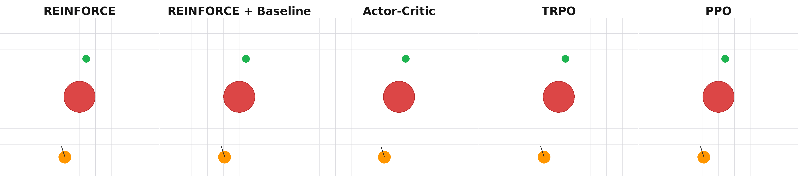
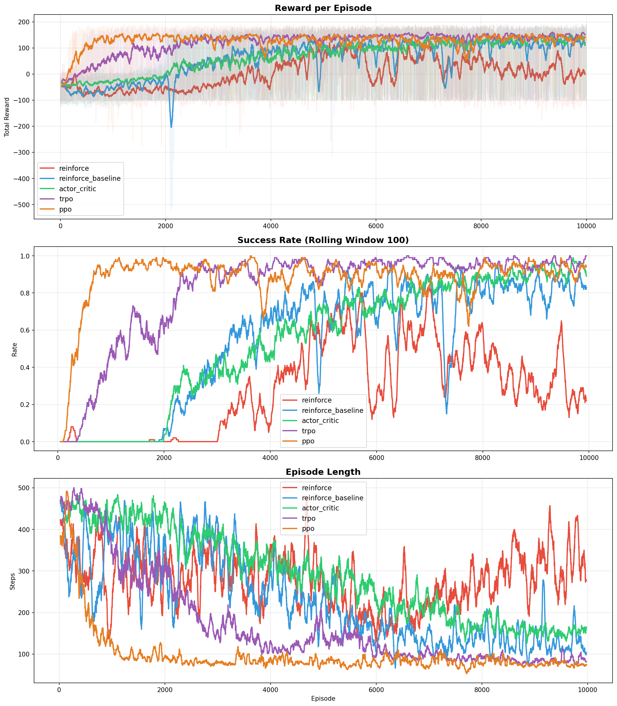
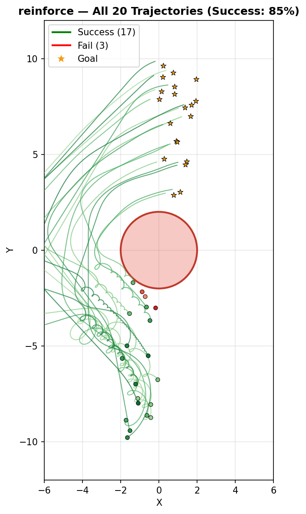
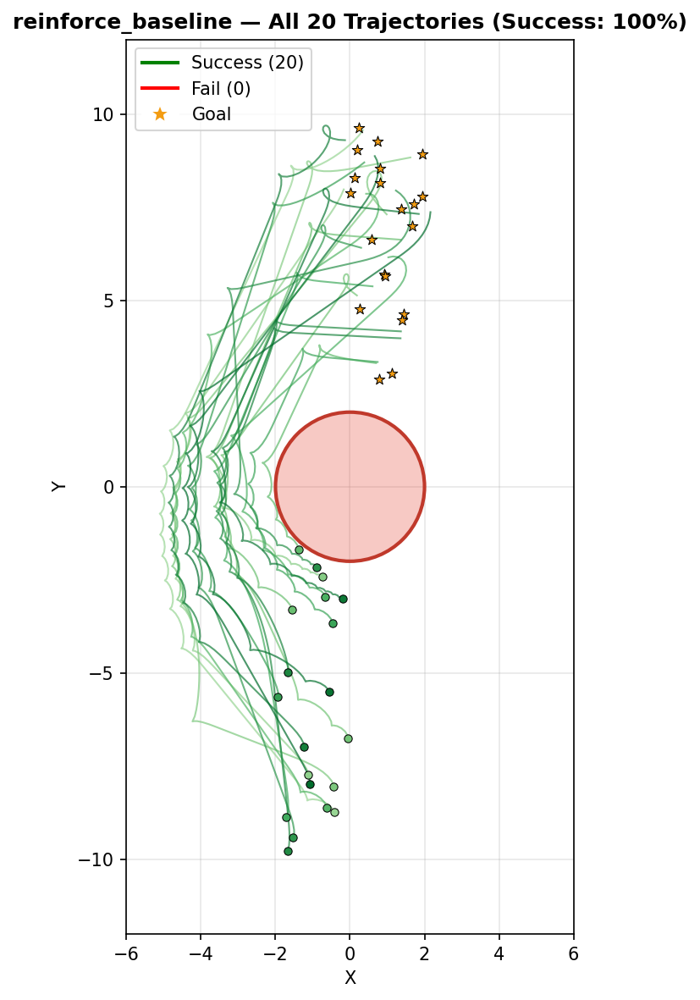
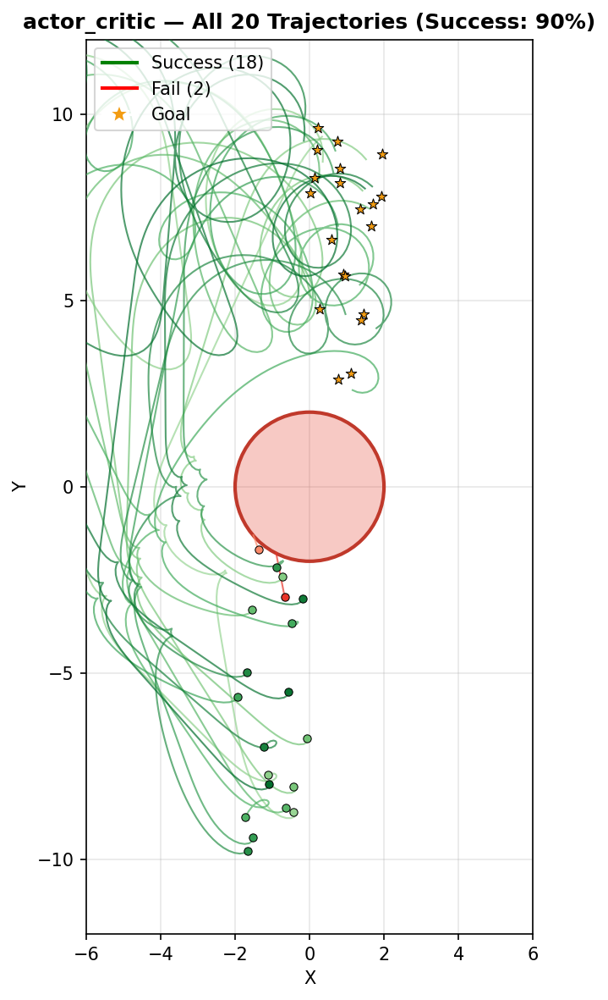
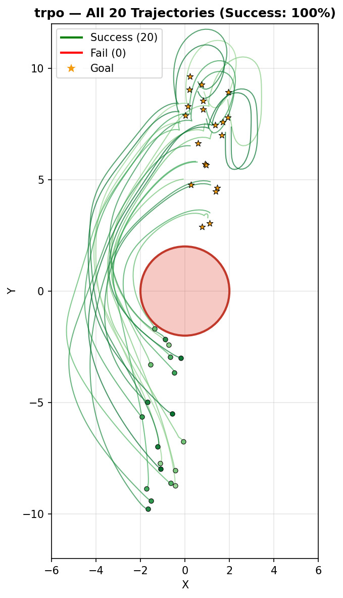
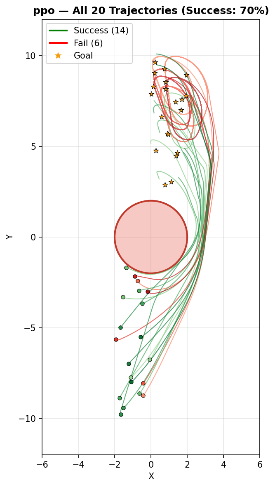

# RL-Move: Differential Drive Navigation with Reinforcement Learning

Training an RL agent (differential drive robot) to navigate from a random start to a random goal on a 2D plane while avoiding a circular obstacle at the origin.

<p align="center">
  
</p>

---

## Problem Statement

| Parameter | Value |
|-----------|-------|
| Agent spawn | x ∈ [−2, 0], y ∈ [−10, 0] |
| Goal spawn | x ∈ [0, 2], y ∈ [0, 10] |
| Obstacle | Circle at (0, 0), radius = 2 |
| Motion model | Differential Drive |

---

## Differential Drive Kinematics

Robot state is (x, y, θ), actions are left/right wheel velocities (v_l, v_r):

$$\dot{x} = \frac{v_r + v_l}{2}\cos\theta, \qquad \dot{y} = \frac{v_r + v_l}{2}\sin\theta, \qquad \dot{\theta} = \frac{v_r - v_l}{L}$$

where L = 0.5 is the wheelbase. Euler integration with Δt = 0.1.

---

## Environment (Gymnasium)

- **Observation (8D):** [x, y, cos θ, sin θ, g_x, g_y, d_goal, d_obs]
- **Action:** [v_l, v_r] ∈ [−2, 2]
- **Reward:**

$$r_t = \underbrace{-0.05}_{\text{step penalty}} + \underbrace{5.0 \cdot (d_{t-1} - d_t)}_{\text{progress}} - \underbrace{0.01 \cdot |v_r - v_l|}_{\text{spin penalty}}$$

| Event | Reward |
|-------|--------|
| Goal reached (d_goal < 0.5) | +100 |
| Collision (d_obs < 2.0) | −100 |
| Timeout (500 steps) | Truncation |

---

## Algorithms

### 1. REINFORCE (Monte Carlo Policy Gradient)

$$\nabla_\theta J = \mathbb{E}\left[\sum_t \nabla_\theta \log \pi_\theta(a_t|s_t) \cdot G_t\right], \qquad G_t = \sum_{k=0}^{T-t} \gamma^k r_{t+k}$$

### 2. REINFORCE + Baseline

$$\nabla_\theta J = \mathbb{E}\left[\sum_t \nabla_\theta \log \pi_\theta(a_t|s_t) \cdot (G_t - V_\phi(s_t))\right]$$

### 3. Actor-Critic (A2C + GAE)

$$\hat{A}_t^{\text{GAE}} = \sum_{l=0}^{\infty} (\gamma\lambda)^l \delta_{t+l}, \qquad \delta_t = r_t + \gamma V(s_{t+1}) - V(s_t)$$

### 4. TRPO (Trust Region Policy Optimization)

$$\max_\theta\; \mathbb{E}\left[\frac{\pi_\theta(a|s)}{\pi_{\theta_{\text{old}}}(a|s)} \hat{A}(s,a)\right], \qquad \text{s.t.}\; \overline{D}_{\text{KL}}(\theta_{\text{old}} \| \theta) \leq \delta$$

### 5. PPO (Proximal Policy Optimization)

$$L^{\text{CLIP}} = \mathbb{E}\left[\min\left(r_t(\theta)\hat{A}_t,\; \text{clip}(r_t(\theta), 1{-}\varepsilon, 1{+}\varepsilon)\hat{A}_t\right)\right]$$

---

## Training Curves (10 000 episodes)

<p align="center">
  
</p>

---

## Learned Trajectories (20 evaluation episodes)

<table align="center">
  <tr>
    <td align="center"><b>REINFORCE</b></td>
    <td align="center"><b>REINFORCE + Baseline</b></td>
    <td align="center"><b>Actor-Critic</b></td>
    <td align="center"><b>TRPO</b></td>
    <td align="center"><b>PPO</b></td>
  </tr>
  <tr>
    <td></td>
    <td></td>
    <td></td>
    <td></td>
    <td></td>
  </tr>
</table>

---

## Evaluation Results (20 episodes, best model)

| Method | Mean Reward | Success Rate | Mean Length |
|--------|:-:|:-:|:-:|
| REINFORCE | 124.66 | 85 % | 207.8 |
| REINFORCE + Baseline | **152.90** | **100 %** | 146.1 |
| Actor-Critic (A2C) | 129.70 | 90 % | 182.7 |
| TRPO | **157.13** | **100 %** | **103.2** |
| PPO | 119.36 | 70 % | 211.6 |

---

## Project Structure

```
RL-Move/
├── src/
│   ├── agent/              # Algorithm implementations
│   │   ├── networks.py     # PolicyNetwork (Gaussian), ValueNetwork
│   │   ├── base_agent.py   # Shared interface, GAE, returns
│   │   ├── reinforce.py
│   │   ├── reinforce_baseline.py
│   │   ├── actor_critic.py
│   │   ├── trpo.py
│   │   └── ppo.py
│   ├── environment/
│   │   └── diff_drive_env.py   # Gymnasium environment
│   ├── training/
│   │   ├── trainer.py          # Training loop
│   │   └── logger.py           # CSV / JSON logging
│   └── utils/
│       └── config.py           # Hyperparameters
├── run/
│   ├── train.py            # Train a single algorithm
│   ├── evaluate.py         # Evaluate + trajectory plots
│   ├── compare.py          # Train multiple algorithms
│   ├── plot.py             # Plot from CSV logs
│   └── record_compare.py   # Side-by-side GIF
├── models/                 # Saved weights
├── logs/                   # CSV and JSON logs
├── plots/                  # Figures
├── gifs/                   # Animations
└── requirements.txt
```

---

## Quick Start

```bash
pip install -r requirements.txt
```

**Train a single algorithm:**

```bash
python run/train.py --agent_method ppo --num_episodes 10000 --seed 42
```

**Compare all five:**

```bash
python run/compare.py --num_episodes 10000 --seed 42
```

**Evaluate:**

```bash
python run/evaluate.py --load_model models/trpo/best_model.pth --agent_method trpo --num_episodes 20
```

**GIF comparison:**

```bash
python run/record_compare.py --seed 3 --white \
  reinforce:models/reinforce/best_model.pth \
  reinforce_baseline:models/reinforce_baseline/best_model.pth \
  actor_critic:models/actor_critic/best_model.pth \
  trpo:models/trpo/best_model.pth \
  ppo:models/ppo/best_model.pth
```
